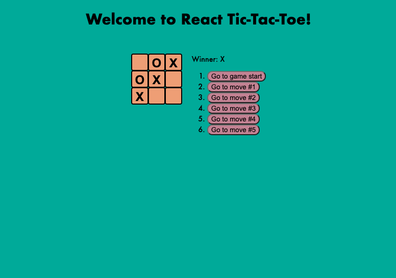

# React Tic-Tac-Toe
The following React application is React Tic-Tac-Toe! 
# 
## Getting Started:
The following is the link to the deployed app.

## Technologies Used:

## Credits
- (Favicon) <a href="https://www.flaticon.com/free-icons/tic-tac-toe" title="tic tac toe icons">Tic tac toe icons created by Freepik - Flaticon</a>
- (React Tutorial) <a href="https://reactjs.org/tutorial/tutorial.html" title="tic tac toe icons">Reactjs.org</a>

## Next Steps
- Display the location for each move in the format (col, row) in the move history list.
- Bold the currently selected item in the move list.
- Rewrite Board to use two loops to make the squares instead of hardcoding them.
- Add a toggle button that lets you sort the moves in either ascending or descending order.
- When someone wins, highlight the three squares that caused the win.
- When no one wins, display a message about the result being a draw.